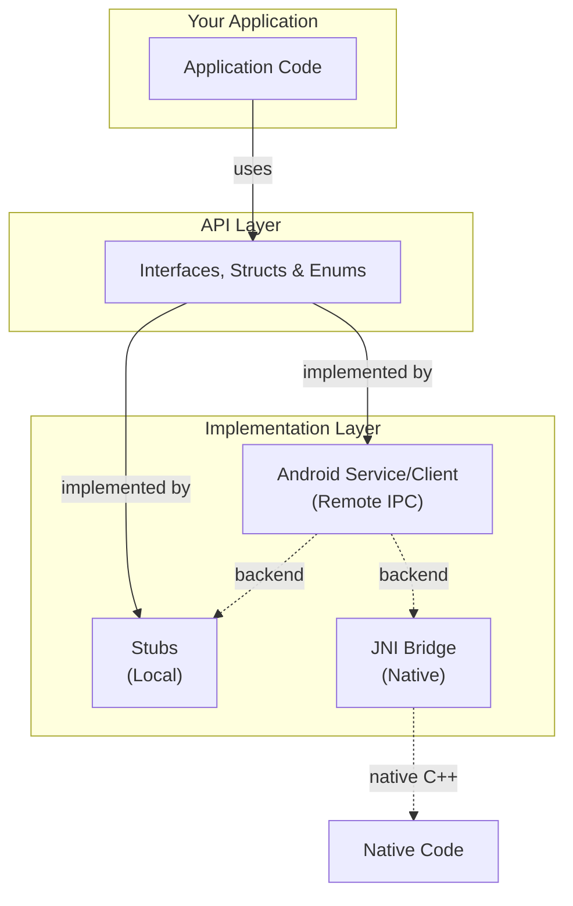

import CodeBlock from '@theme/CodeBlock';
import helloWorldModuleComponent from '!!raw-loader!./data/helloworld.module.yaml';

# Features

This guide explains how to use the generated code, what features are available, and their benefits.

:::info
A feature is a part of the template that generates a specific aspect of the code. For example, the `api` feature generates the core interfaces and data types.
:::

## Get started

This template generates a Java and Android SDK from your API definitions. The generated code ranges from pure Java interfaces and data types to a full Android service/client architecture with Messenger-based IPC.

:::note
Basic Java knowledge is required. For Android features, familiarity with Android Services, Messenger IPC, and Gradle multi-module projects will help.
:::

### Code generation

Follow the documentation for [code generation](/docs/guide/quick-start) in general and [CLI](/docs/cli/generate) or the [Studio](/docs/studio/intro) tools.
Or try the [quick start guide](../quickstart/index.md) first, which shows how to prepare an API and generate code from it.

:::tip
For questions regarding this template please go to our [discussions page](https://github.com/orgs/apigear-io/discussions). For feature requests or bug reports please use the [issue tracker](https://github.com/apigear-io/template-java/issues).
:::

### Example API

The following code snippet contains the _API_ definition which is used throughout this guide to demonstrate the generated code and its usage.

<details>
    <summary>Hello World API (click to expand)</summary>
    <CodeBlock language="yaml" showLineNumbers>{helloWorldModuleComponent}</CodeBlock>
</details>

## Available Features

### Core Features

Core features generate Java types and implementations from your API definition:

- [api](api.md) - generates interfaces, event listeners, abstract base classes, enums, and structs as a Gradle multi-module project
- [stubs](stubs.md) - generates ready-to-use implementation classes with default behavior, property change detection, and async support

### Extended Features

Extended features add Android IPC and native integration:

- [android](android.md) - generates Android Messenger-based service/client architecture for cross-process and cross-app communication
- [jnibridge](jnibridge.md) - generates JNI bridge classes for integrating with native C++ code, such as Unreal Engine

### Test Features

- `testserviceapp` - generates an Android test application for the service side, with UI controls for setting properties, emitting signals, and managing the service lifecycle
- `testclientapp` - generates an Android test application for the client side, with UI controls for binding to a service, setting properties, and calling operations

### Example Features

- `example` - generates a standalone example application that instantiates all key classes to verify the SDK compiles and links correctly

Each feature can be selected using the solution file or via the command line tool.

:::note
_Features are case-sensitive. Make sure to always **use lowercase.**_
:::

:::tip
The _meta_ feature `all` enables all specified features of the template. If you want to see the full extent of the generated code, `all` is the easiest solution.
Please note, `all` is part of the code generator and not explicitly used within templates.
:::

## Architecture

The features listed above compose into a layered runtime architecture:



*Your application programs against the generated API interfaces. Stubs provide local implementations, Android service/client enables cross-process communication via Messenger IPC, and the JNI bridge connects to native C++ code.*

**Key architectural points:**

- Communication between apps uses the **Android Messenger** framework — a lightweight IPC mechanism built on `Handler` and `Binder`
- Each API interface gets **its own dedicated service and client**. A module with multiple interfaces (e.g. `Hello` and `Goodbye`) generates separate, independent service/client pairs for each.
- The client (`HelloClient`) implements the same `IHello` interface as the local stubs, so your application code works identically regardless of whether the backend is local or remote

## Folder structure

This graph shows the folder structure generated for a module with all features enabled. Each API module becomes a Gradle composite build with multiple sub-modules.

```bash
📂java_hello_world
 ┣ 📜build.gradle
 ┣ 📜settings.gradle
 ┣ 📂ioWorld
 ┃ ┣ 📜settings.gradle
 ┃ ┣ 📂ioWorld_api                  # api feature
 ┃ ┃ ┗ 📂src/main/java/ioWorld/ioWorld_api
 ┃ ┃   ┣ 📜IHello.java
 ┃ ┃   ┣ 📜IHelloEventListener.java
 ┃ ┃   ┣ 📜AbstractHello.java
 ┃ ┃   ┣ 📜Message.java
 ┃ ┃   ┗ 📜When.java
 ┃ ┣ 📂ioWorld_impl                 # stubs feature
 ┃ ┃ ┗ 📂src/main/java/ioWorld/ioWorld_impl
 ┃ ┃   ┗ 📜HelloService.java
 ┃ ┣ 📂ioWorld_android_messenger    # android feature
 ┃ ┃ ┗ 📂src/main/java/ioWorld/ioWorld_android_messenger
 ┃ ┃   ┣ 📜HelloMessageType.java
 ┃ ┃   ┣ 📜HelloParcelable.java
 ┃ ┃   ┣ 📜MessageParcelable.java
 ┃ ┃   ┗ 📜WhenParcelable.java
 ┃ ┣ 📂ioWorld_android_service      # android feature
 ┃ ┃ ┗ 📂src/main/java/ioWorld/ioWorld_android_service
 ┃ ┃   ┣ 📜HelloServiceAdapter.java
 ┃ ┃   ┣ 📜HelloServiceProvider.java
 ┃ ┃   ┣ 📜HelloServiceStarter.java
 ┃ ┃   ┣ 📜HelloBaseServiceLifecycleController.java
 ┃ ┃   ┗ 📜IHelloServiceProvider.java
 ┃ ┣ 📂ioWorld_android_client       # android feature
 ┃ ┃ ┗ 📂src/main/java/ioWorld/ioWorld_android_client
 ┃ ┃   ┗ 📜HelloClient.java
 ┃ ┣ 📂ioWorldjniservice            # jnibridge feature
 ┃ ┣ 📂ioWorldjniclient             # jnibridge feature
 ┃ ┣ 📂ioWorldserviceexample         # testserviceapp feature
 ┃ ┗ 📂ioWorld_client_example        # testclientapp feature
 ┗ 📂javaHelloWorld_example          # example feature
```

:::note
The module name `io.world` is converted to `ioWorld` for the Gradle project and package naming. Each feature generates one or more Gradle sub-modules within the composite build.
:::
